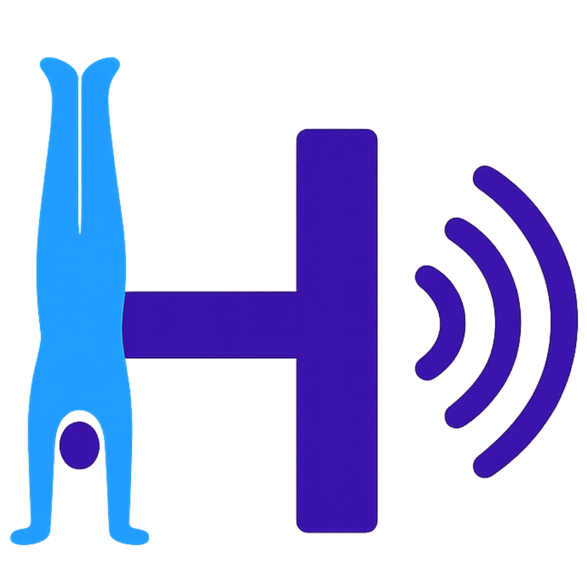

# HandyCue Native

  

  <table>
    <tr>
      <td valign="middle" style="border: none;">
        
      </td>
      <td valign="middle" style="border: none; padding-left: 12px;">
        
      </td>
    </tr>
  </table>

React Native (Expo) app — migrated from the HandyCue PWA, powered by Supabase.

## About HandyCue

**HandyCue** is a voice-guided training timer built for handstand practice. When you’re balancing on your hands, it’s almost impossible to start, pause, adjust, or even look at a timer—so HandyCue **calls out the timing** while you stay focused on the handstand. Train holds, entries, shape transitions, drills, and custom sequences—with clear voice cues guiding your timing.

### Features

- **HoldOn** — Voice-guided timers for balance holds and endurance training.
- **EntryBuddy** — A smart counter for handstand entries and repetitions.
- **ShapeJam** — Practice controlled shape transitions with timed cues. Coordinate with other handstanders and create synchronized training videos.
- **DrillDJ** — Tempo-driven drills with rhythm-based voice cues.
- **CueCraft** — Build custom flows: combine get-ready countdowns, timed holds, voice cues, reps, sets, and rest into your own sequences.

### Why train with voice cues?

Training with spoken cues helps develop body memory and timing. Instead of anticipating movements by counting in your head, your body learns to respond naturally to verbal signals—leading to more accurate training, smoother transitions, and precise timing for endurance holds and timed drills. HandyCue acts like a personal coach calling out the timing so you can focus on balance, control, and consistency.

The in-app **Behind HandyCue** screen tells the full story of how the app came from real practice.

Questions? [darrmorgan@gmail.com](mailto:darrmorgan@gmail.com)

---

*To run the project locally: see [SETUP.md](./SETUP.md).*
